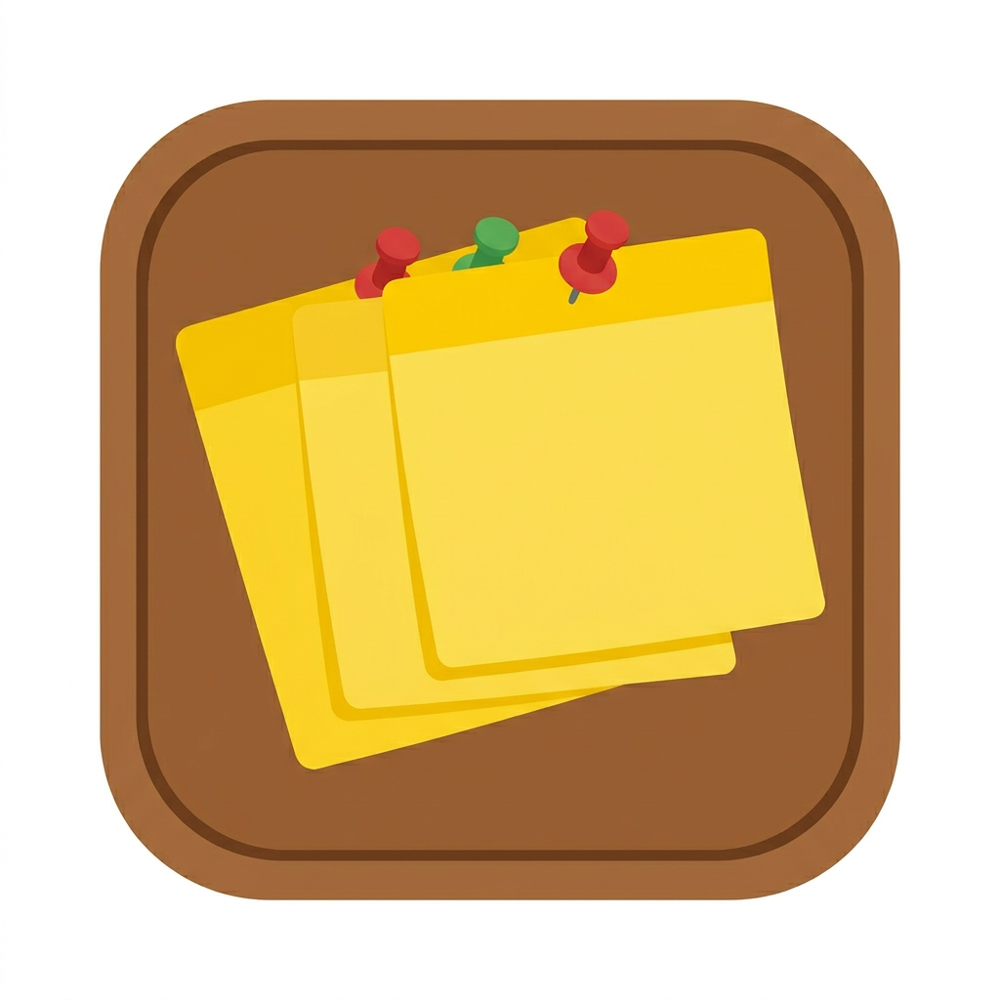

# 📝 ملاحظاتي - Cork Board Notes

تطبيق ملاحظات لاصقة (Sticky Notes) بتصميم لوحة الفلين، مبني بـ Flutter مع دعم كامل للعربية وواجهة RTL.



## ✨ المميزات الرئيسية

### 🎨 تصميم مميز
- **خلفية لوحة فلين حقيقية** مرسومة بـ `CustomPainter`
- **ملاحظات لاصقة** بميلان عشوائي طبيعي لكل ملاحظة
- **6 ألوان مختلفة** للورقة: أصفر، وردي، أخضر، أزرق، برتقالي، بنفسجي
- **دبابيس ثلاثية الأبعاد** مرسومة برادياليت غرادينت حقيقي

### 🗂️ تنظيم الملاحظات
- **3 فئات جاهزة**: الرئيسية، العمل، العائلة
- **نقل بين الفئات** بنقرة واحدة من الشريط العلوي
- **تثبيت الملاحظات المهمة** في الشاشة الرئيسية
- **تكرار الملاحظات** بسرعة

### 📌 نظام الأولويات (الدبابيس)
- 🟢 **عادي** (أخضر)
- 🔴 **عاجل** (أحمر)
- 🔵 **معلومة** (أزرق)
- 🟡 **مهم** (أصفر)
- تصفية سريعة حسب لون الدبوس

### ⏰ التذكيرات
- تحديد **تاريخ ووقت** التذكير (ليس التاريخ فقط)
- منتقي تقويم عربي مخصص بأسماء الأشهر العربية
- منتقي ساعة بصيغة 12 ساعة (صباحًا/مساءً)
- **مؤشر بصري** على الملاحظة عند وجود تذكير
- **شارة تذكير** داخل الملاحظة مع زر حذف سريع

### ✏️ تحرير متقدم للنص
- تنسيق: **غامق**, *مائل*, <u>مسطر</u>, ~~شطب~~, تظليل
- تحكم في حجم الخط (10-32 px)
- تغيير لون ورقة الملاحظة
- تغيير لون الدبوس
- وضع القراءة فقط

### 🔍 بحث وتصفية
- بحث فوري في محتوى الملاحظات
- بحث داخل فئة محددة أو في الكل
- تصفية حسب الأولوية (لون الدبوس)

### 💾 النسخ الاحتياطي
- **تصدير** جميع الملاحظات بصيغة JSON منسّقة
- **استيراد** من JSON مع خيار الاستبدال أو الإضافة
- نسخ إلى الحافظة ومشاركة النص

### ⚙️ إعدادات قابلة للتخصيص
- الوضع الفاتح / الداكن / التلقائي
- 5 خيارات لترتيب الملاحظات
- تفعيل/إيقاف الاهتزازات (Haptic Feedback)
- إحصائيات شاملة لكل فئة

### 🛡️ حماية البيانات
- **تأكيد الخروج** عند وجود تعديلات غير محفوظة (PopScope)
- تخزين محلي آمن بـ Hive
- لا يتطلب اتصالاً بالإنترنت

## 🛠️ التقنيات المستخدمة

| التقنية | الاستخدام |
|---------|----------|
| Flutter 3.35.4 | إطار العمل |
| Dart 3.9.2 | لغة البرمجة |
| Provider | إدارة الحالة |
| Hive + hive_flutter | قاعدة بيانات محلية للملاحظات |
| shared_preferences | حفظ الإعدادات |
| intl | التعامل مع التاريخ والوقت |
| uuid | توليد معرفات فريدة |
| share_plus | مشاركة الملاحظات |

## 🚀 تشغيل التطبيق

```bash
# تثبيت الاعتمادات
flutter pub get

# تشغيل على الويب
flutter run -d chrome

# بناء نسخة إنتاجية للويب
flutter build web --release

# بناء APK للأندرويد
flutter build apk --release
```

## 📁 هيكل المشروع

```
lib/
├── main.dart                      # نقطة البداية
├── models/
│   └── note.dart                  # نموذج الملاحظة
├── services/
│   ├── notes_service.dart         # خدمة إدارة الملاحظات (Hive)
│   └── settings_service.dart      # خدمة الإعدادات (SharedPreferences)
├── screens/
│   ├── home_screen.dart           # الشاشة الرئيسية + التبويبات
│   ├── board_screen.dart          # لوحة الفلين لكل فئة
│   ├── note_edit_screen.dart      # تحرير/إنشاء ملاحظة
│   ├── search_screen.dart         # بحث في الملاحظات
│   ├── settings_screen.dart       # الإعدادات والنسخ الاحتياطي
│   └── calendar_picker_dialog.dart # منتقي التقويم العربي
├── utils/
│   ├── app_colors.dart            # الألوان والثيمات
│   ├── date_formatter.dart        # تنسيق التواريخ بالعربية
│   └── haptics.dart               # اهتزازات مع احترام الإعدادات
└── widgets/
    ├── cork_background.dart       # خلفية لوحة الفلين
    ├── sticky_note_card.dart      # بطاقة الملاحظة اللاصقة
    ├── pushpin.dart               # دبوس التثبيت 3D
    └── top_tabs.dart              # التبويبات العلوية
```

## 📝 الترخيص

مشروع مفتوح المصدر.
